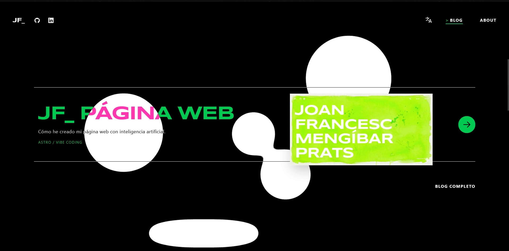
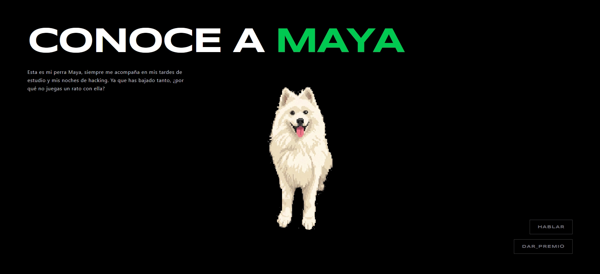

In this blog post, I will show how I created this static website using basic web programming knowledge and artificial intelligence—from choosing the development tools to the final optimizations, including the portfolio's goals and design. Finally, I will share my current opinion on *vibe coding* based on the development of this project, which I am leaving open source for anyone looking for inspiration.  

## 1. Goals

When I thought about how I wanted my website to be, I envisioned an original portfolio with a blog to showcase all my hacking projects. The most important aspects were modularity between sections—to modify anything whenever I want—and scalability, so that as the blog grows, I have to touch as little code as possible.

### 1.1 Architecture
How do you create a website's architecture without any prior experience? You ask artificial intelligence. This is how the following structure emerged:

```text
📁 project-root/
├── 📁 public/
└── 📁 src/
    ├── 📁 assets/
    ├── 📁 components/
    │   ├── 📁 about/
    │   │   └── 📄 About.astro
    │   ├── 📁 blog/
    │   │   ├── 📄 FeaturedBlogs.astro
    │   │   └── 📄 LavaLampBackground.astro
    │   ├── 📁 home/
    │   │   ├── 📄 CodeMaskLayer.astro
    │   │   └── 📄 NameLayer.astro
    │   ├── 📄 navbar.astro
    │   └── 📄 SamoyedGame.astro
    ├── 📁 content/
    │   └── 📁 blog/
    ├── 📁 i18n/
    ├── 📁 icons/
    ├── 📁 layouts/
    └── 📁 pages/
        ├── 📁 blog/
        ├── 📁 en/
        ├── 📁 va/
        └── 📄 index.astro
```

I don't know if this is the most efficient architecture, and it wasn't worth my time to research it (I'm not a web developer; if I were, I would), but for now, it fulfills its function perfectly.

### 1.2 Scalability and Speed

The factor that worried me the most was the blog's scalability; I wanted it to be as simple as possible. Currently, I only have to create a .md file in Spanish in the src/content/blog/es folder, write the post in Markdown format, and use AI to handle the translations to save time. Once that's done, I create the en/ and va/ files.

### 1.3 Why Astro?

Astro is an excellent choice if you want to build static websites. Furthermore, the amount of web content created by Midudev on his YouTube channel serves as the perfect tutorial to understand the tool.

## 2. Web Design

Personally, this has been my favorite part. In the following [link](https://www.awwwards.com/websites/gsap/), you can find a collection of websites built with GSAP. The best programmers in the world are on that platform—people there are on another level.

While browsing, I came across the [WHITEOUT_WORKS](https://www.whiteoutworks.com/) website, and the moment I saw it, I knew how I wanted my portfolio to look. Having these kinds of references for design amateurs is a godsend.


### 2.1 Divide and Conquer
Artificial intelligence is very lazy: if you give it a generic task, you'll get a mediocre result, but if you give it a very specific prompt, it can work wonders. That's why I created the following strategy: In Astro, parts of the website are separated into components. The idea is to divide these into sub-components that fulfill a single objective whenever possible.

For example, in the blog component of the main page, I separated the lava animation logic from the blog list logic. Why? I will never modify the lava animation again. If I keep scaling the code, copying and pasting it into the AI might lead to unwanted modifications, as hallucinations are very common in large codebases.

```text
📁 src/
├── 📁 components/
│   ├── 📁 blog/
│   │   ├── 📄 FeaturedBlogs.astro
│   │   └── 📄 LavaLampBackground.astro
```



### A Personal Touch

I've always been fascinated by pixel art animations from old games, so I decided to create one for my website—and that's how the "SamoyedGame.astro" component was born. This consists of a pixel art animation of my dog. How did I make it? First, you need real images to create the pixel art sketches. Once you have them, you generate a video of the dog performing the action (in my case, I generated 3). Then, you divide that video into frames and use Nano Banana to create the pixel art frames. Once you have them, you join them in piskel.com to create the spritesheet.




## 3. Optimization

The metric I used to measure the website's performance is Chrome's Lighthouse. This gives you a score out of 100 for "Performance", "Accessibility", "Best Practices", and "SEO". My goal was a score higher than 90 in "Performance". Before I started optimizing the website, this was the score:


Once you have the code finished, it's as simple as reviewing it with AI using an optimization prompt.

## 4. Conclusion

Vibe coding is great for personal projects that don't require serious programming; however, as of today, it is far from replacing a programmer. The amount of hallucinations AI has is incredible, but the worst part is that they are designed to hide them—they lie to your face. Ultimately, we are living in a race between companies to dominate a new sector, so "anything goes" to get customers, who in turn provide data to train the next model.

If this were a larger project, it would be impossible for me to maintain it simply with AI without some knowledge of web architecture. This isn't critical in itself, but I've read that many companies are using AI to perform security audits. I hope they are using them as tools alongside a trained expert; otherwise, the hallucinations I've experienced while programming this in a critical environment could be fatal.

[GitHub of the website](https://github.com/JoanMengibarPrats/JoanMengibarPrats-Web)