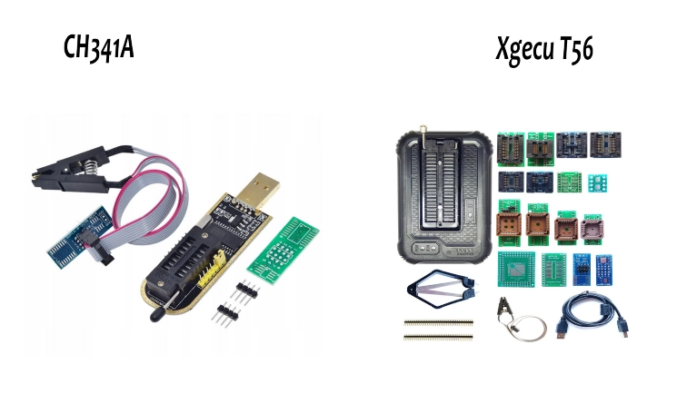
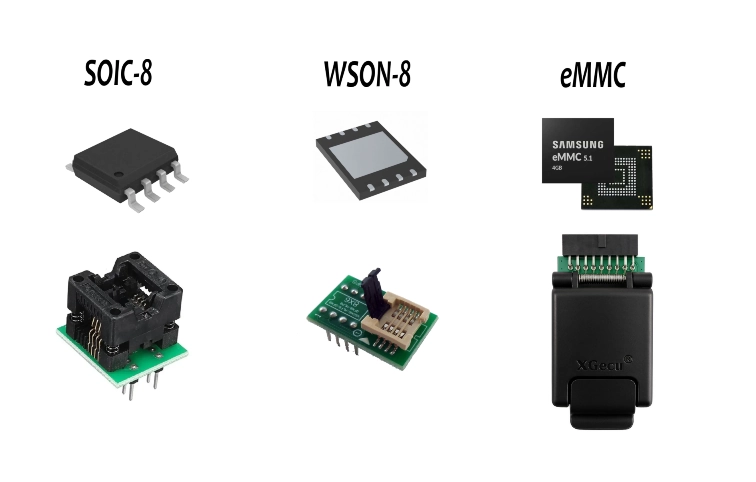
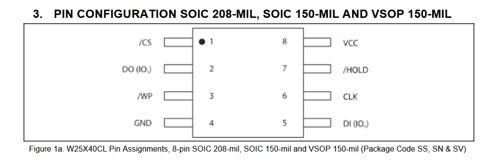
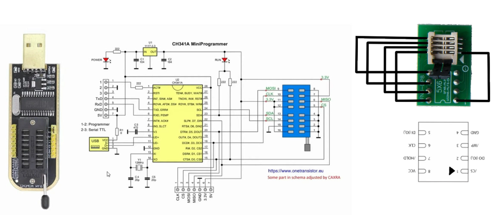

## Extracción de firmware
En esta guía aprenderás el proceso crítico para extraer la información de un chip Flash de manera debida. Analizaremos los tipos de chips más comunes en el ecosistema IoT, dónde encontrarlos y, lo más importante, cómo emplear debidamente el CH341A. Este programador es la opción low-cost por excelencia. A través de mi experiencia personal, te compartiré los trucos y precauciones necesarias para convertir esta herramienta barata en un aliado profesional.

### ¿Qué chips podemos encontrarnos?

El ecosistema IoT emplea una gran variedad de memorias flash. Las más comunes y baratas son las memorias **SOIC-8**; por ende, son las más aceptadas por el lector **CH341A**. Estas se pueden leer con la pinza SOIC o con el adaptador para este tipo de memorias.

Luego será más común encontrarnos memorias **WSON-8** de 8x6 o 5x6 en dispositivos IoT que necesiten un poco más de memoria. Para este tipo de memorias necesitaremos adaptadores específicos como el de la imagen de abajo; además, este tipo de memorias suelen dar bastantes problemas en lecturas con el CH341A. Para este tipo de memoria ya es recomendable invertir en un lector XGecu T48, que es la gama baja de esta marca por unos 60€ a día de hoy, pero este no soporta memorias eMMC; para ello necesitarías ya el T56.

Para un nivel más avanzado donde nos encontramos con memorias eMMC o MCU recomiendo el lector XGecu T76, es la herramienta profesional del sector y algunas veces nos encontramos este tipo de chips. Las memorias NAND, por cómo están diseñadas, requieren que el procesador lidie con errores, bloques dañados, etc. Una eMMC es una memoria NAND con un controlador integrado para delegar la tarea que antes gestionaba el procesador; este chip es autónomo en este sentido, por eso es más común encontrarlo en dispositivos complejos como: Smart Hubs, Pantallas Inteligentes, cuadros de mandos digitales y sistemas de entretenimiento, Gateways Industriales...

## Etapas de la extracción del firmware

### Reconocimiento

La primera etapa de la extracción de firmware es el reconocimiento del modelo del chip, esto se realiza leyendo la parte superior del chip. En los chips comerciales es muy sencillo encontrar el datasheet del modelo en específico, por otra parte, hay empresas que emplean chips privados en los que es muy complicado encontrar esta especificación.

En este ejemplo se analizará la memoria flash chip **WINBOND W25X40CL**, un modelo muy común de memoria con un datasheet accesible.

En este podemos encontrar la arquitectura, el diagrama de bloques, especificaciones técnicas... Una de las cosas más importantes es la configuración de pines del chip.

También es importante identificar el **voltaje** que soporta el chip para luego configurar el lector; la mayoría son de 3.3V, pero también hay de 1.8V y de 5V.

### Conexión del chip

Para realizar correctamente la lectura del chip hay que continuar el circuito electrónico de la memoria principal, por eso **es muy importante fijarse en el punto del chip**; este indicará la conexión /CS. Siguiendo la conexión del CS es muy sencillo colocarlo bien.

La pinza SOIC-8 emplea el mismo tipo de conexión; sin embargo, en algunos modelos he tenido que desconectar el cable del VCC ya que me daba errores de conexión, dando energía al chip mediante la carga normal de la placa base, en este caso era el cable normal de energía de la cámara, esto con una placa base se puede hacer de forma sencilla.

### Software de lectura

En el repositorio oficial de [CH341A](https://github.com/YTEC-info/CH341A-Softwares) encontramos los softwares compatibles con esta herramienta. En este repositorio encontrarás una gama variada de software para diferentes SO compatibles con muchos chips SOIC-8. Para memorias WSON-8 he tenido bastantes problemas empleando este lector, por lo que recomendaría el lector T56 con su software, ya que es el mejor del mercado, pero es una herramienta profesional bastante cara.

### Consejos

Personalmente recomiendo emplear la metodología de desoldar el chip; aunque sea más compleja, es una lectura mucho más limpia. La pinza, para leer el chip, introduce voltaje en este para activarlo, lo que puede resultar en activar otras partes de la placa base y ensuciar la copia extraída.

Otra buena práctica es la de realizar varias lecturas del firmware para luego comparar los hashes de las distintas imágenes; esto nos garantiza que ha habido una buena lectura. Si por lo que sea se va a mover la imagen a otra máquina, una vez realizado el traslado recomiendo comprobar el hash de nuevo para garantizar la cadena de custodia de la imagen original; un solo bit contaminado en el firmware nos puede complicar muchísimo la vida.

Esta es una de las formas más comunes pero no la única, el firmware se puede extraer desde la interfaz de usuario UART o JTAG, a veces desde la propia página web de soporte, otras desde la interfaz web del dispositivo, interceptando actualizaciones... Como ves el límite está en la creatividad de cada uno para conseguirlo.

También advertirte que muchas veces el contenido del firmware está cifrado, sobre todo en dispositivos críticos como cámaras de seguridad o datáfonos, sin embargo, en mi opinión, la seguridad por oscuridad revela que si sorteamos esta barrera las probabilidades de encontrar mayores vulnerabilidades en el código aumentan exponencialmente.

## Resumen del procedimiento

1. Reconocimiento del chip.
2. Desoldar el chip, realizar limpieza de estaño de los pads y repasar con alcohol isopropílico.
3. Colocar el chip en el lector, fijándonos bien en la marca del /CS.
4. Realizar la copia con nuestro software preferido, realizar dos o tres copias para comprobar el éxito de la lectura.