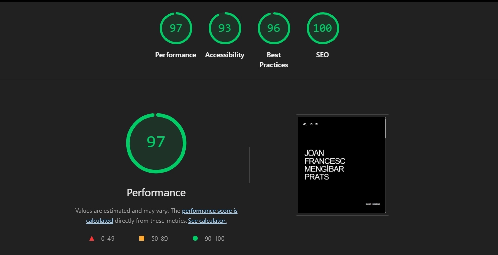

En aquest blog ensenyaré com, amb els coneixements bàsics de programació web i amb intel·ligència artificial, he creat aquesta pàgina web estàtica, des de l'elecció de les eines de desenvolupament fins a les últimes optimitzacions, passant pels objectius del portfolio i el seu disseny. Finalment, afegiré la meua opinió actual del *vibe coding* basada en el desenvolupament d'aquest projecte, el qual deixaré open source per a qualsevol que s'hi vulga inspirar.  

## 1. Objectius

Quan vaig pensar en com volia la meua pàgina web, vaig pensar en un portfolio original amb un blog per a afegir tots els meus projectes de hacking. El més important era la modularitat entre seccions per a modificar qualsevol cosa quan vulga i l'escalabilitat perquè, a mesura que vaja creixent el blog, haja de tocar el mínim codi possible.

### 1.1 Arquitectura
Com crees l'arquitectura d'una pàgina web sense tindre cap experiència? Li ho preguntes a la intel·ligència artificial. Així és com va sorgir la següent estructura:

```text
📁 arrel-del-projecte/
├── 📁 public/
└── 📁 src/
    ├── 📁 assets/
    ├── 📁 components/
    │   ├── 📁 about/
    │   │   └── 📄 About.astro
    │   ├── 📁 blog/
    │   │   ├── 📄 FeaturedBlogs.astro
    │   │   └── 📄 LavaLampBackground.astro
    │   ├── 📁 home/
    │   │   ├── 📄 CodeMaskLayer.astro
    │   │   └── 📄 NameLayer.astro
    │   ├── 📄 navbar.astro
    │   └── 📄 SamoyedGame.astro
    ├── 📁 content/
    │   └── 📁 blog/
    ├── 📁 i18n/
    ├── 📁 icons/
    ├── 📁 layouts/
    └── 📁 pages/
        ├── 📁 blog/
        ├── 📁 en/
        ├── 📁 va/
        └── 📄 index.astro
```

Desconec si és l'arquitectura més eficient, no em mereix la pena invertir el temps d'investigació (no soc desenvolupador web; si ho fora, ho faria), però de moment compleix la seua funció perfectament.

### 1.2 Escalabilitat i Rapidesa

El factor que més em preocupava era l'escalabilitat del blog; volia que fora el més simple possible. Actualment, només he de crear un arxiu .md en espanyol en la carpeta src/content/blog/es, escriure el post amb el format Markdown, i realitzar les traduccions amb intel·ligència artificial per a estalviar temps. Una vegada fet, cree els arxius en/ i va/.

### 1.3 Per què Astro?

Astro és una molt bona decisió si vols programar pàgines web estàtiques; a més, la quantitat de contingut de pàgines web creades per [Midudev](https://www.youtube.com/@midulive/playlists) en el seu canal de YouTube són el tutorial perfecte per a entendre l'eina.

## 2. Disseny Web


Personalment, aquesta ha estat la meua part preferida. En el següent [enllaç](https://www.awwwards.com/websites/gsap/) tens una recopilació de pàgines web amb GSAP. En eixa plataforma estan els millors programadors del món, allí la gent està boja.

Navegant per allí em vaig trobar amb la pàgina web de [WHITEOUT_WORKS](https://www.whiteoutworks.com/) i, en el moment en què la vaig veure, em vaig imaginar com volia que fora el meu portfolio. Tindre aquest tipus de referències per a gent amateur en disseny és una maravila.


### 2.1 Divideix i venceràs

La intel·ligència artificial és molt perezosa: si li dones una missió genèrica rebràs un resultat molt cutre, però si li dones un prompt molt concret pot fer meravelles. Per això, vaig crear la següent estratègia: en Astro se separen les parts de la pàgina web en components; la idea és dividir aquests en subcomponents que complisquen un objectiu a soles, a menys que no siga possible.

Per exemple, en el component blog de la pàgina principal, he separat la lògica de l'animació de la lava amb la de la llista del blog. Per què? L'animació de la lava mai més la modificaré; si continue escalant el codi, a l'hora de fer copiar i apegar en la IA pot modificar alguna part que no vulgues, ja que són molt comunes les al·lucinacions en codis grans.

```text
📁 src/
├── 📁 components/
│   ├── 📁 blog/
│   │   ├── 📄 FeaturedBlogs.astro
│   │   └── 📄 LavaLampBackground.astro
```


### Un toc personal

Sempre m'han fascinat les animacions pixel art dels jocs antics, per això em vaig decidir a crear-ne una per a la meua pàgina web; així és com va nàixer el component "SamoyedGame.astro". Aquest consisteix en una animació pixel art de la meua gossa. Com l'he feta? Primer necessites unes imatges reals per a crear els esbossos pixel art; una vegada els tens, generes un vídeo de la gossa realitzant l'acció (en el meu cas en vaig generar 3). Després divideixes eixe vídeo en frames i mitjançant Nano Banana crees els frames pixel art; una vegada els tens, els juntes en piskel.com per a crear el spritesheet.


## 3. Optimització

La mètrica que he utilitzat per a mesurar el rendiment de la pàgina web és el Lighthouse de Chrome; aquesta et dona una puntuació sobre 100 de la "Performance", "Accessibility", "Best Practices" i "SEO". El meu objectiu era una puntuació superior a 90 en la "Performance"; abans de posar-me a optimitzar la pàgina web, esta era la puntuació:



Una vegada ja tens el codi acabat, és tan simple com revisar-lo amb IA amb un prompt d'optimització.

## 4. Conclusió

El vibe coding està molt bé per a projectes personals que no requereixen una programació molt seriosa; tanmateix, a hores d'ara, està molt lluny de substituir un programador. La quantitat d'al·lucinacions que té la intel·ligència artificial és increïble, però el pitjor és que estan dissenyades per a dissimular-les: et menteixen a la cara. Al cap i a la fi estem vivint una carrera d'empreses per dominar un nou sector, per la qual cosa "tot val" per tal d'aconseguir clients, que al seu torn entreguen dades per a entrenar el següent model.

Si això fora un projecte més gran, se'm faria impossible de mantindre simplement amb IA sense uns coneixements d'arquitectura web. Això com a tal no és molt greu, però he llegit que moltes empreses estan utilitzant IA per a realitzar auditories de seguretat; espere que les estiguen utilitzant com a eines juntament amb un expert format, en cas contrari, les al·lucinacions que he viscut programant això en un entorn crític podrien ser fatals.

[GitHub de la pàgina web](https://github.com/JoanMengibarPrats/JoanMengibarPrats-Web)